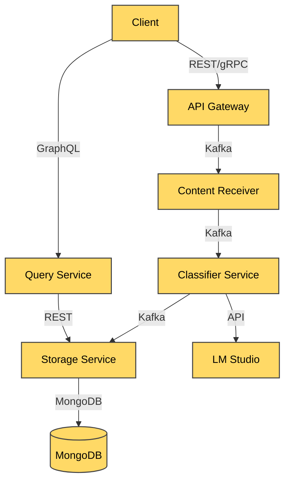

# Medical Content Processing Pipeline

## Architecture Overview




## Core Components

### 1. API Gateway (Port 8000)
- **Entry Point**: REST & GraphQL endpoints
- **Responsibilities**:
  - Request validation
  - Protocol translation
  - Kafka message production
- **Tech**: Express.js, Apollo Server

### 2. Content Receiver (gRPC, Port 50051)
- **Protocol**: gRPC
- **Responsibilities**:
  - Receive medical content
  - Publish to Kafka
- **Tech**: gRPC, KafkaJS

### 3. Classifier Service
- **Input**: Kafka messages
- **Processing**:
  - Keyword-based classification
  - LLM enhancement via LM Studio
- **Output**: Kafka messages with enriched content
- **Tech**: KafkaJS, Axios

### 4. Storage Service (Port 8001)
- **Database**: MongoDB
- **Responsibilities**:
  - Content persistence
  - REST API for data retrieval
- **Tech**: Express.js, Mongoose

### 5. Query Service (GraphQL, Port 4000)
- **Interface**: GraphQL
- **Features**:
  - Flexible queries
  - Category filtering
- **Tech**: Apollo Server

## Data Flow

1. **Ingestion**:
   - Clients submit content via REST or gRPC
   - Messages published to Kafka `incoming-medical-content` topic

2. **Processing**:
   - Classifier consumes messages
   - Applies medical categorization
   - Enhances with LM Studio
   - Publishes to `classified-content` topic

3. **Storage**:
   - Storage service persists to MongoDB
   - Adds timestamps and metadata

4. **Querying**:
   - Clients query via GraphQL or REST
   - Results returned with full context

## Getting Started

### Prerequisites
- Node.js 16+
- MongoDB
- Kafka
- LM Studio (optional)

### Installation
```bash
git clone https://github.com/your-repo/medical-pipeline.git
cd medical-pipeline
npm install
```

### Configuration
Edit `config/kafka-config.js`:
```javascript
module.exports = {
  kafka: {
    brokers: ['localhost:9092']
  },
  TOPICS: {
    INCOMING: 'incoming-medical-content',
    CLASSIFIED: 'classified-content'
  }
}
```

### Running Services
```bash
# Start API Gateway
cd api-gateway
npm start

# Start Content Receiver
cd content-receiver
npm start

# Start Classifier
cd classifier-service
npm start

# Start Storage Service
cd storage-service
npm start

# Start Query Service
cd query-service
npm start
```

## API Documentation

### REST Endpoints
`POST /api/content`
```json
{
  "text": "Patient symptoms...",
  "metadata": {}
}
```

### GraphQL Queries
```graphql
{
  contents {
    id
    text
    category
    lm_enhancement
  }
  
  contentsByCategory(category: "cardiology") {
    id
    text
  }
}
```

## Monitoring
View Kafka messages:
```bash
# Incoming content
kafka-console-consumer --bootstrap-server localhost:9092 --topic incoming-medical-content

# Classified content
kafka-console-consumer --bootstrap-server localhost:9092 --topic classified-content
```

## License
MIT License - See LICENSE.md for details
``` 
