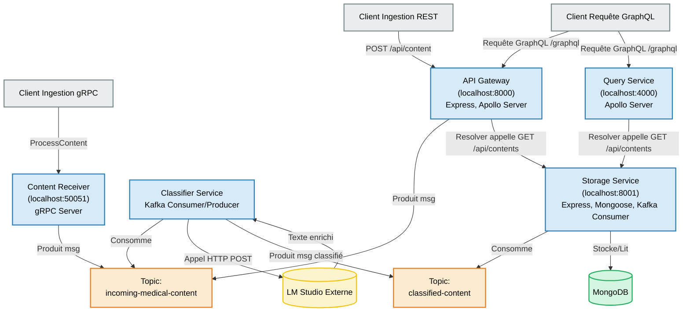

Absolument ! Voici une proposition de README.md pour votre projet, incluant un schéma Mermaid et une explication détaillée du fonctionnement.

# Pipeline de Traitement de Contenu Médical

Ce projet implémente un pipeline de traitement de contenu médical utilisant une architecture microservices. Il ingère des données textuelles médicales, les classifie, les enrichit à l'aide d'un modèle de langage (LM Studio), les stocke et les expose via des API REST et GraphQL.

## Table des Matières

- [Aperçu du Projet](#aperçu-du-projet)
- [Fonctionnalités Clés](#fonctionnalités-clés)
- [Architecture](#architecture)
  - [Diagramme d'Architecture (Mermaid)](#diagramme-darchitecture-mermaid)
  - [Flux de Données Détaillé](#flux-de-données-détaillé)
- [Technologies Utilisées](#technologies-utilisées)
- [Prérequis](#prérequis)
- [Installation](#installation)
- [Lancement des Services](#lancement-des-services)
- [Points d'Accès (API Endpoints)](#points-daccès-api-endpoints)
  - [API Gateway (Port 8000)](#api-gateway-port-8000)
  - [Content Receiver Service (Port 50051)](#content-receiver-service-port-50051)
  - [Storage Service (Port 8001)](#storage-service-port-8001)
  - [Query Service (Port 4000)](#query-service-port-4000)
- [Structure du Projet (Exemple)](#structure-du-projet-exemple)
- [Améliorations Possibles](#améliorations-possibles)

## Aperçu du Projet

L'objectif principal est de fournir une plateforme robuste et évolutive pour traiter et analyser du contenu médical. Le système est décomposé en plusieurs microservices communiquant de manière asynchrone via Apache Kafka, garantissant découplage et résilience.

## Fonctionnalités Clés

*   **Ingestion Multi-canaux :** Réception de contenu via API REST et gRPC.
*   **Traitement Asynchrone :** Utilisation de Kafka pour la communication découplée entre les services.
*   **Classification Automatique :** Catégorisation du contenu médical basée sur des mots-clés.
*   **Enrichissement par IA :** Intégration avec LM Studio pour obtenir des analyses ou résumés de texte.
*   **Persistance des Données :** Stockage du contenu traité dans MongoDB.
*   **Consultation Flexible :** API GraphQL pour des requêtes ciblées et API REST pour un accès simple.

## Architecture

### Diagramme d'Architecture (Mermaid)

Flux de Données Détaillé

Ingestion du Contenu :

Via API Gateway (REST) : Un client envoie une requête POST à /api/content de l'API Gateway. Le corps de la requête contient { "text": "...", "metadata": {...} }. L'API Gateway publie ensuite ce message sur le topic Kafka incoming-medical-content.

Via Content Receiver (gRPC) : Un client gRPC appelle la méthode ProcessContent du Content Receiver Service avec les données du contenu. Ce service publie également le message sur le topic Kafka incoming-medical-content.

Classification et Enrichissement :

Le Classifier Service est un consommateur du topic incoming-medical-content.

Pour chaque message reçu, il effectue une classification basique en cherchant des mots-clés médicaux prédéfinis dans le texte.

Ensuite, il envoie le texte à une instance locale de LM Studio (via un appel HTTP POST à http://localhost:1234/v1/chat/completions) pour obtenir un enrichissement (analyse, résumé, etc.).

Le Classifier Service combine les données originales, la catégorie et l'enrichissement de LM Studio, puis publie ce nouveau message sur le topic Kafka classified-content.

Stockage :

Le Storage Service est un consommateur du topic classified-content.

Lorsqu'il reçoit un message, il le persiste dans une base de données MongoDB (collection contents).

Ce service expose également une API REST (GET /api/contents) pour permettre la récupération de toutes les données stockées.

Consultation du Contenu :

Via API Gateway (GraphQL) : L'API Gateway expose un endpoint GraphQL (/graphql). Les resolvers pour les requêtes de contenu (ex: query { contents { ... } }) interrogent l'API REST (GET /api/contents) du Storage Service pour récupérer les données.

Via Query Service (GraphQL) : Un service GraphQL dédié (Query Service sur le port 4000) offre également des capacités de requêtes avancées (ex: contentsByCategory). Ses resolvers interrogent aussi l'API REST du Storage Service.

Technologies Utilisées

Langage/Runtime : Node.js

Frameworks Web/API : Express.js

Communication Asynchrone : Apache Kafka (avec la librairie kafkajs)

Base de Données : MongoDB (avec l'ODM mongoose)

API GraphQL : Apollo Server (apollo-server-express, apollo-server, graphql-type-json)

Communication RPC : gRPC (@grpc/grpc-js, @grpc/proto-loader)

Client HTTP : Axios (pour appeler LM Studio)

Modèle de Langage : LM Studio (exécuté localement comme un service externe)

Prérequis

Avant de commencer, assurez-vous d'avoir installé :

Node.js (v16 ou supérieur recommandé)

npm ou yarn

Apache Kafka (et Zookeeper) fonctionnant localement (par défaut sur localhost:9092)

MongoDB fonctionnant localement (par défaut sur mongodb://localhost:27017/medical)

LM Studio installé et exécuté localement, avec un modèle compatible chargé (par exemple, deepseek-r1-distill-qwen-7b mentionné dans le code) et le serveur API démarré (par défaut sur http://localhost:1234).

Installation

Clonez ce dépôt :

git clone <votre-url-de-repo>
cd <nom-du-repo>
IGNORE_WHEN_COPYING_START
content_copy
download
Use code with caution.
Bash
IGNORE_WHEN_COPYING_END

Installez les dépendances pour chaque service. Si vous avez une structure de monorepo avec des package.json séparés dans chaque dossier de service (ex: api-gateway/, classifier-service/, etc.) :

cd api-gateway
npm install
cd ../classifier-service
npm install
# Répétez pour chaque service (content-receiver, storage-service, query-service)
cd ..
IGNORE_WHEN_COPYING_START
content_copy
download
Use code with caution.
Bash
IGNORE_WHEN_COPYING_END

Si vous avez un package.json unique à la racine et que les imports relatifs sont corrects, un npm install à la racine pourrait suffire.

Configuration Kafka :
Assurez-vous que les topics Kafka sont créés (ou que Kafka est configuré pour les créer automatiquement) :

incoming-medical-content

classified-content

processing-errors (optionnel, mais une bonne pratique)

Le fichier config/kafka-config.js centralise la configuration du client Kafka.

Fichier .proto :
Le fichier content-receiver/content_receiver.proto est nécessaire pour le service gRPC. Assurez-vous qu'il est présent et correct. Exemple :

// content-receiver/content_receiver.proto
syntax = "proto3";

package contentreceiver;

import "google/protobuf/struct.proto";

service ContentReceiver {
  rpc ProcessContent (ProcessContentRequest) returns (ProcessContentResponse);
}

message ProcessContentRequest {
  string text = 1;
  google.protobuf.Struct metadata = 2; // Ou string json_metadata = 2;
}

message ProcessContentResponse {
  string status = 1;
  optional string message = 2;
}
IGNORE_WHEN_COPYING_START
content_copy
download
Use code with caution.
Protobuf
IGNORE_WHEN_COPYING_END
Lancement des Services

Il est important de démarrer les services dans le bon ordre en raison des dépendances.

Dépendances Externes :

Démarrez Zookeeper et Apache Kafka.

Démarrez MongoDB.

Démarrez LM Studio et assurez-vous que le serveur API est actif et que le modèle deepseek-r1-distill-qwen-7b (ou celui configuré) est chargé.

Microservices de l'Application :
Ouvrez un terminal pour chaque service et naviguez vers son répertoire.

Content Receiver Service :

cd content-receiver # (ou le chemin approprié)
node server.js # (ou le nom de votre fichier principal)
# Devrait afficher: gRPC server running on http://localhost:50051
IGNORE_WHEN_COPYING_START
content_copy
download
Use code with caution.
Bash
IGNORE_WHEN_COPYING_END

Classifier Service :

cd classifier-service # (ou le chemin approprié)
node classifier.js # (ou le nom de votre fichier principal)
# Devrait afficher des logs de connexion Kafka et d'attente de messages
IGNORE_WHEN_COPYING_START
content_copy
download
Use code with caution.
Bash
IGNORE_WHEN_COPYING_END

Storage Service :

cd storage-service # (ou le chemin approprié)
node storage.js # (ou le nom de votre fichier principal)
# Devrait afficher: Connected to MongoDB
# Devrait afficher: Storage Service running on http://localhost:8001
# Et des logs de connexion Kafka
IGNORE_WHEN_COPYING_START
content_copy
download
Use code with caution.
Bash
IGNORE_WHEN_COPYING_END

Query Service :

cd query-service # (ou le chemin approprié)
node server.js # (ou le nom de votre fichier principal)
# Devrait afficher: 🚀 Query Service ready at http://localhost:4000
IGNORE_WHEN_COPYING_START
content_copy
download
Use code with caution.
Bash
IGNORE_WHEN_COPYING_END

API Gateway :

cd api-gateway # (ou le chemin approprié)
node server.js # (ou le nom de votre fichier principal)
# Devrait afficher: Kafka producer connected
# Devrait afficher: API Gateway running on http://localhost:8000
IGNORE_WHEN_COPYING_START
content_copy
download
Use code with caution.
Bash
IGNORE_WHEN_COPYING_END
Points d'Accès (API Endpoints)
API Gateway (Port 8000)

REST Endpoint : POST /api/content

Rôle : Soumettre un nouveau contenu médical.

Request Body (JSON) :

{
  "text": "Le patient se plaint de douleurs thoraciques et d'un rythme cardiaque irrégulier.",
  "metadata": { "patient_id": "12345", "source_system": "EHR-XYZ" }
}
IGNORE_WHEN_COPYING_START
content_copy
download
Use code with caution.
Json
IGNORE_WHEN_COPYING_END

Réponse (JSON) :

{ "message": "Content received", "status": "SUCCESS" }
IGNORE_WHEN_COPYING_START
content_copy
download
Use code with caution.
Json
IGNORE_WHEN_COPYING_END

Exemple curl :

curl -X POST -H "Content-Type: application/json" \
-d '{ "text": "Le patient se plaint de douleurs thoraciques et d''un rythme cardiaque irrégulier.", "metadata": { "patient_id": "12345" } }' \
http://localhost:8000/api/content
IGNORE_WHEN_COPYING_START
content_copy
download
Use code with caution.
Bash
IGNORE_WHEN_COPYING_END

GraphQL Endpoint : POST /graphql (ou via le Playground Apollo si activé)

Rôle : Interroger le contenu médical stocké.

Exemple de requête :

query GetContents {
  contents {
    id
    text
    category
    timestamp
    metadata
  }
}
IGNORE_WHEN_COPYING_START
content_copy
download
Use code with caution.
Graphql
IGNORE_WHEN_COPYING_END
Content Receiver Service (Port 50051)

gRPC Service : contentreceiver.ContentReceiver

Méthode : ProcessContent

Rôle : Soumettre un nouveau contenu médical via gRPC.

Requête (basée sur content_receiver.proto) : ProcessContentRequest { text: "...", metadata: Struct{...} }

Réponse : ProcessContentResponse { status: "SUCCESS" }

Note : Nécessite un client gRPC pour interagir.

Storage Service (Port 8001)

REST Endpoint : GET /api/contents

Rôle : Récupérer tous les contenus médicaux stockés.

Réponse (JSON) : Tableau d'objets MedicalContent.

[
  {
    "id": "60c72b2f9b1e8a3f7c8d4f5e",
    "text": "Le patient se plaint de douleurs thoraciques...",
    "category": "cardiology",
    "timestamp": "2023-01-15T10:30:00.000Z",
    "metadata": { "patient_id": "12345" },
    "lm_enhancement": "Analyse: Douleurs thoraciques suggérant un potentiel problème cardiaque."
  },
  // ... autres contenus
]
IGNORE_WHEN_COPYING_START
content_copy
download
Use code with caution.
Json
IGNORE_WHEN_COPYING_END

Exemple curl :

curl http://localhost:8001/api/contents
IGNORE_WHEN_COPYING_START
content_copy
download
Use code with caution.
Bash
IGNORE_WHEN_COPYING_END
Query Service (Port 4000)

GraphQL Endpoint : POST /graphql (ou via le Playground Apollo si activé)

Rôle : Interroger le contenu médical stocké, avec des options de filtrage.

Exemple de requête (tous les contenus) :

query GetAllContents {
  contents {
    id
    text
    category
    timestamp
    metadata
    lm_enhancement
  }
}
IGNORE_WHEN_COPYING_START
content_copy
download
Use code with caution.
Graphql
IGNORE_WHEN_COPYING_END

Exemple de requête (filtrée par catégorie) :

query GetCardiologyContents {
  contentsByCategory(category: "cardiology") {
    id
    text
    category
    lm_enhancement
  }
}
IGNORE_WHEN_COPYING_START
content_copy
download
Use code with caution.
Graphql
IGNORE_WHEN_COPYING_END
Structure du Projet (Exemple)
.
├── api-gateway/
│   ├── server.js
│   └── package.json
├── classifier-service/
│   ├── classifier.js
│   └── package.json
├── content-receiver/
│   ├── content_receiver.proto
│   ├── server.js
│   └── package.json
├── query-service/
│   ├── server.js
│   └── package.json
├── storage-service/
│   ├── storage.js
│   └── package.json
├── config/
│   └── kafka-config.js
└── README.md
IGNORE_WHEN_COPYING_START
content_copy
download
Use code with caution.
IGNORE_WHEN_COPYING_END

(Cette structure est une supposition basée sur les imports. Adaptez-la à votre structure réelle.)

Améliorations Possibles

Gestion d'Erreurs Robuste : Mettre en place des Dead Letter Queues (DLQ) dans Kafka pour les messages qui ne peuvent pas être traités.

Authentification et Autorisation : Sécuriser les endpoints.

Monitoring et Logging : Intégrer des outils comme Prometheus/Grafana et ELK Stack.

Tests : Ajouter des tests unitaires, d'intégration et de bout-en-bout.

Containerisation : Utiliser Docker et Docker Compose pour faciliter le déploiement et le développement.

CI/CD : Mettre en place un pipeline d'intégration et de déploiement continus.

Configuration Centralisée : Utiliser des variables d'environnement ou un service de configuration.

Affinement de LM Studio : Optimiser les prompts et les paramètres de LM Studio pour de meilleurs résultats.

