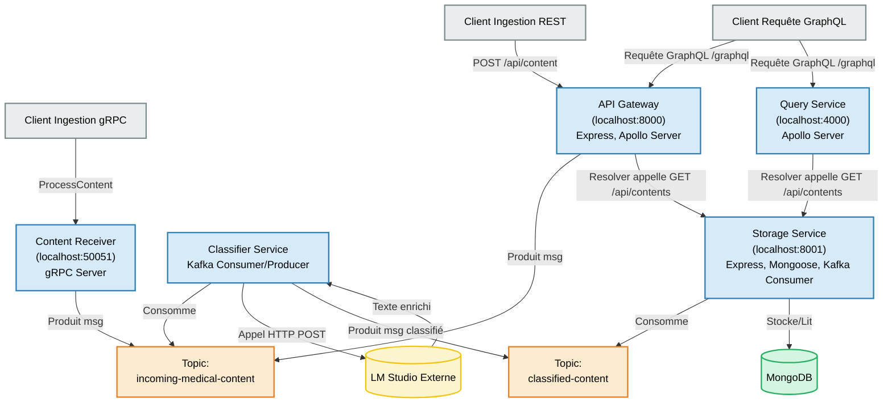

Très bien ! Voici une version **recréée et structurée proprement** de votre `README.md`, incluant un schéma Mermaid, des sections claires et professionnelles, tout en conservant l’esprit de votre message original.

---

# 🩺 Pipeline de Traitement de Contenu Médical

Ce projet met en œuvre un pipeline distribué pour ingérer, enrichir, stocker et interroger du contenu médical. Il s'appuie sur une architecture microservices, Kafka pour la communication asynchrone, MongoDB pour le stockage et LM Studio pour l’enrichissement par IA.

---

## 📑 Table des Matières

* [🚀 Aperçu du Projet](#-aperçu-du-projet)
* [✨ Fonctionnalités Clés](#-fonctionnalités-clés)
* [🧱 Architecture Globale](#-architecture-globale)

  * [📊 Diagramme Mermaid](#-diagramme-mermaid)
  * [🔁 Détail du Flux de Données](#-détail-du-flux-de-données)
* [🛠️ Technologies Utilisées](#-technologies-utilisées)
* [⚙️ Prérequis](#-prérequis)
* [📦 Installation](#-installation)
* [▶️ Lancement des Services](#️-lancement-des-services)
* [🔗 Points d'Accès API](#-points-daccès-api)
* [📁 Structure du Projet](#-structure-du-projet)
* [🧩 Améliorations Possibles](#-améliorations-possibles)

---

## 🚀 Aperçu du Projet

L'objectif est de construire un système **scalable** et **modulaire** pour traiter du texte médical. Les messages sont transmis entre microservices via **Apache Kafka**, enrichis par un modèle de langage (via **LM Studio**), stockés dans **MongoDB** et consultables via des API **REST** et **GraphQL**.

---

## ✨ Fonctionnalités Clés

✅ Ingestion via API REST ou gRPC

✅ Traitement asynchrone et découplé via Kafka

✅ Classification automatique par mots-clés

✅ Enrichissement intelligent via LM Studio

✅ Stockage durable dans MongoDB

✅ Accès flexible via GraphQL ou REST


---

## 🧱 Architecture Globale




---

## 🔁 Détail du Flux de Données

1. **Ingestion**

   * Un client envoie une requête `POST /api/content` (REST) ou appelle `ProcessContent` (gRPC).
   * Le message est publié sur `incoming-medical-content`.

2. **Classification & Enrichissement**

   * Le `Classifier Service` consomme les messages.
   * Classification simple basée sur mots-clés.
   * Envoi du texte à **LM Studio** pour résumé/analyse.
   * Résultat enrichi publié sur `classified-content`.

3. **Stockage**

   * Le `Storage Service` consomme le topic `classified-content`.
   * Les données sont enregistrées dans **MongoDB**.
   * Une API REST (`GET /api/contents`) permet la récupération.

4. **Consultation**

   * Via API Gateway (GraphQL) ou `Query Service`, les clients peuvent interroger les contenus.
   * Les resolvers appellent l’API REST du `Storage Service`.

---
# ... (Toutes les sections précédentes du README) ...

## Tests et Démonstration du Fonctionnement

Cette section décrit comment tester les différentes parties du pipeline et illustre le fonctionnement attendu. Assurez-vous que tous les services (Kafka, MongoDB, LM Studio, et vos microservices) sont démarrés comme décrit dans la section [Lancement des Services](#lancement-des-services).

### Outils Recommandés pour les Tests

*   **Postman / Insomnia / `curl` :** Pour tester les endpoints REST et GraphQL.
*   **Client gRPC (BloomRPC, grpcurl, Postman gRPC) :** Pour tester le `Content Receiver Service`.
*   **Outil de gestion Kafka (Kafka Tool, Offset Explorer, kcat/kafkacat) :** Pour inspecter les messages dans les topics Kafka.
*   **Client MongoDB (MongoDB Compass, `mongosh`) :** Pour vérifier les données dans la base de données.
*   **Apollo Sandbox / GraphQL Playground :** Intégré avec Apollo Server (accessible via `http://localhost:8000/graphql` et `http://localhost:4000/graphql` si activé) pour tester les requêtes GraphQL.

---

### Flux 1: Ingestion via API Gateway (REST) et Traitement Complet

1.  **Étape 1: Soumission du Contenu via API Gateway (REST)**
    *   **Action :** Envoyez une requête `POST` à `http://localhost:8000/api/content` avec un corps JSON.
        ```json
        {
          "text": "Le patient présente des symptômes de grippe : fièvre élevée et toux sèche. Antécédents de cardiopathie.",
          "metadata": { "patient_id": "P001", "source": "Consultation Dr. Bernard" }
        }
        ```
    *   **Observations attendues :**
        *   L'API Gateway répond avec un statut `200 OK` et `{ "message": "Content received", "status": "SUCCESS" }`.
        *   Logs de l'API Gateway indiquant la réception et la production du message vers Kafka.
    *   **Capture d'écran suggérée (api_gateway_post_request.png) :**
        *   Postman (ou équivalent) montrant la requête envoyée et la réponse reçue.
        ```
        <!-- Insérez ici une capture d'écran de Postman montrant la requête POST et la réponse -->
        ```

2.  **Étape 2: Vérification du Message sur le Topic `incoming-medical-content`**
    *   **Action :** Utilisez un outil Kafka pour inspecter le topic `incoming-medical-content`.
    *   **Observations attendues :**
        *   Un nouveau message apparaît sur le topic, contenant le `text` et les `metadata` soumis, ainsi que les `headers` (`source: api-gateway`, `timestamp`).
    *   **Capture d'écran suggérée (kafka_topic_incoming.png) :**
        *   Votre outil Kafka montrant le message sur le topic `incoming-medical-content`.
        ```
        <!-- Insérez ici une capture d'écran de l'outil Kafka montrant le message sur incoming-medical-content -->
        ```

3.  **Étape 3: Traitement par le Classifier Service et LM Studio**
    *   **Action :** Observez les logs du `Classifier Service` et, si possible, de LM Studio.
    *   **Observations attendues (Classifier Service Logs) :**
        *   Log indiquant la réception du message depuis `incoming-medical-content`.
        *   Log indiquant la catégorie déterminée (ex: `general` ou `cardiology` si un mot-clé est trouvé).
        *   Log indiquant l'appel à LM Studio.
        *   Log indiquant la réponse reçue de LM Studio (l'enrichissement).
        *   Log indiquant la production du message enrichi vers `classified-content`.
    *   **Observations attendues (LM Studio Logs - si visible) :**
        *   Log d'une requête entrante avec le texte à analyser.
    *   **Capture d'écran suggérée (classifier_service_logs.png) :**
        *   Terminal montrant les logs pertinents du `Classifier Service`.
        ```
        <!-- Insérez ici une capture d'écran des logs du Classifier Service -->
        ```

4.  **Étape 4: Vérification du Message sur le Topic `classified-content`**
    *   **Action :** Utilisez un outil Kafka pour inspecter le topic `classified-content`.
    *   **Observations attendues :**
        *   Un nouveau message apparaît sur le topic, contenant les données originales, `category`, `lm_enhancement`, et `classifiedAt`.
    *   **Capture d'écran suggérée (kafka_topic_classified.png) :**
        *   Votre outil Kafka montrant le message enrichi sur le topic `classified-content`.
        ```
        <!-- Insérez ici une capture d'écran de l'outil Kafka montrant le message sur classified-content -->
        ```

5.  **Étape 5: Stockage par le Storage Service**
    *   **Action :** Observez les logs du `Storage Service`.
    *   **Observations attendues (Storage Service Logs) :**
        *   Log indiquant la réception du message depuis `classified-content`.
        *   Log indiquant que le contenu a été stocké dans MongoDB.
    *   **Capture d'écran suggérée (storage_service_logs.png) :**
        *   Terminal montrant les logs pertinents du `Storage Service`.
        ```
        <!-- Insérez ici une capture d'écran des logs du Storage Service -->
        ```

6.  **Étape 6: Vérification des Données dans MongoDB**
    *   **Action :** Utilisez un client MongoDB pour interroger la collection `contents` dans la base `medical`.
    *   **Observations attendues :**
        *   Un nouveau document existe avec les données correspondantes (texte, métadonnées, catégorie, enrichissement LM).
    *   **Capture d'écran suggérée (mongodb_data.png) :**
        *   MongoDB Compass (ou équivalent) montrant le document inséré.
        ```
        <!-- Insérez ici une capture d'écran de MongoDB Compass montrant le nouveau document -->
        ```

7.  **Étape 7: Consultation via l'API REST du Storage Service**
    *   **Action :** Envoyez une requête `GET` à `http://localhost:8001/api/contents`.
    *   **Observations attendues :**
        *   Une réponse JSON contenant un tableau d'objets, incluant le nouveau contenu stocké.
    *   **Capture d'écran suggérée (storage_service_get_api.png) :**
        *   Postman (ou navigateur) montrant la réponse de l'API.
        ```
        <!-- Insérez ici une capture d'écran de la réponse GET /api/contents -->
        ```

8.  **Étape 8: Consultation via GraphQL (API Gateway ou Query Service)**
    *   **Action :** Utilisez Apollo Sandbox/Playground (ou Postman) pour envoyer une requête GraphQL à `http://localhost:8000/graphql` (API Gateway) ou `http://localhost:4000/graphql` (Query Service).
        ```graphql
        query {
          contents {
            id
            text
            category
            lm_enhancement
            metadata
          }
        }
        ```
    *   **Observations attendues :**
        *   Une réponse JSON GraphQL contenant les données du contenu soumis.
    *   **Capture d'écran suggérée (graphql_query_result.png) :**
        *   Apollo Sandbox/Playground montrant la requête et la réponse GraphQL.
        ```
        <!-- Insérez ici une capture d'écran d'Apollo Sandbox/Playground avec la requête et la réponse -->
        ```

---

### Flux 2: Ingestion via Content Receiver Service (gRPC)

1.  **Étape 1: Soumission du Contenu via gRPC**
    *   **Action :** Utilisez un client gRPC pour appeler la méthode `ProcessContent` du service `ContentReceiver` sur `localhost:50051`.
        *   **Requête :**
            ```json // Représentation JSON de la requête gRPC
            {
              "text": "Éruption cutanée observée sur l'avant-bras droit, démangeaisons intenses. Possible réaction allergique.",
              "metadata": { "patient_id": "P002", "source_type": "Observation infirmière" }
            }
            ```
    *   **Observations attendues :**
        *   Le client gRPC reçoit une réponse de succès (ex: `{ "status": "SUCCESS" }`).
        *   Logs du `Content Receiver Service` indiquant la réception et la production du message vers Kafka.
    *   **Capture d'écran suggérée (grpc_client_request.png) :**
        *   Votre client gRPC (BloomRPC, Postman) montrant l'appel et la réponse.
        ```
        <!-- Insérez ici une capture d'écran du client gRPC montrant l'appel et la réponse -->
        ```

2.  **Étape 2: Suite du Traitement**
    *   **Action :** Les étapes suivantes (vérification sur Kafka, traitement par Classifier, stockage, consultation) sont identiques aux étapes 2 à 8 du Flux 1.
    *   **Observations attendues :** Similaires au Flux 1, mais avec les données du message gRPC.
    *   **Captures d'écran suggérées :** Vous pouvez réutiliser les types de captures d'écran du Flux 1, mais avec les données issues de la soumission gRPC.

---

### Notes sur les Captures d'écran

*   Remplacez les commentaires `<!-- Insérez ici une capture d'écran ... -->` par de vraies images.
*   Utilisez des noms de fichiers descriptifs pour vos captures d'écran.
*   Assurez-vous que les captures sont claires et mettent en évidence l'information pertinente.
*   Vous pouvez les intégrer directement dans le README si votre plateforme le supporte (ex: GitHub) en utilisant la syntaxe Markdown : ``

# ... (Section Améliorations Possibles et reste du README) ...
## 🛠️ Technologies Utilisées

| Composant          | Technologie                           |
| ------------------ | ------------------------------------- |
| Langage principal  | Node.js                               |
| Web/API Framework  | Express.js                            |
| API GraphQL        | Apollo Server                         |
| Base de données    | MongoDB + Mongoose                    |
| Bus de messages    | Apache Kafka + kafkajs                |
| IA / NLP           | LM Studio (local, modèle open-source) |
| gRPC Communication | `@grpc/grpc-js`, `@grpc/proto-loader` |
| HTTP Client        | Axios                                 |

---

## ⚙️ Prérequis

* Node.js v16+
* Apache Kafka & Zookeeper (localhost:9092)
* MongoDB (localhost:27017)
* LM Studio (localhost:1234)

  * Modèle chargé (ex : `deepseek-r1-distill-qwen-7b`)
  * Serveur API actif (ex : `/v1/chat/completions`)

---

## 📦 Installation

Clonez le dépôt :

```bash
git clone https://github.com/votre-utilisateur/medical-pipeline.git
cd medical-pipeline
```

Installez les dépendances :

```bash
cd api-gateway && npm install
cd ../classifier-service && npm install
cd ../content-receiver && npm install
cd ../storage-service && npm install
cd ../query-service && npm install
```

---

## ▶️ Lancement des Services

**Démarrage recommandé dans l’ordre suivant :**

1. Kafka + Zookeeper
2. MongoDB
3. LM Studio (modèle chargé, serveur API actif)
4. Microservices :

```bash
# Dans chaque dossier de service
npm run start
```

---

## 🔗 Points d'accès API

| Service         | Type         | Port  | URL/Entrée                 |
| --------------- | ------------ | ----- | -------------------------- |
| API Gateway     | REST/GraphQL | 8000  | `/api/content`, `/graphql` |
| gRPC Receiver   | gRPC         | 50051 | `ProcessContent()`         |
| Storage Service | REST         | 8001  | `/api/contents`            |
| Query Service   | GraphQL      | 4000  | `/graphql`                 |

---

## 📁 Structure du Projet (exemple)

```
medical-pipeline/
├── api-gateway/
├── classifier-service/
├── content-receiver/
├── query-service/
├── storage-service/
├── config/
│   └── kafka-config.js
└── README.md
```

---

## 🧩 Améliorations Possibles

* Ajout de mécanismes de retry / gestion d’erreurs (topic `processing-errors`)
* Authentification / sécurisation des API
* Monitoring (ex: Prometheus + Grafana)
* CI/CD pour déploiement multi-environnement
* Interface Web de visualisation (ex: Next.js + Apollo Client)

---

Souhaitez-vous que je génère ce README sous forme de fichier `.md` ?
