Très bien ! Voici une version **recréée et structurée proprement** de votre `README.md`, incluant un schéma Mermaid, des sections claires et professionnelles, tout en conservant l’esprit de votre message original.

---

# 🩺 Pipeline de Traitement de Contenu Médical

Ce projet met en œuvre un pipeline distribué pour ingérer, enrichir, stocker et interroger du contenu médical. Il s'appuie sur une architecture microservices, Kafka pour la communication asynchrone, MongoDB pour le stockage et LM Studio pour l’enrichissement par IA.

---

## 📑 Table des Matières

* [🚀 Aperçu du Projet](#-aperçu-du-projet)
* [✨ Fonctionnalités Clés](#-fonctionnalités-clés)
* [🧱 Architecture Globale](#-architecture-globale)

  * [📊 Diagramme Mermaid](#-diagramme-mermaid)
  * [🔁 Détail du Flux de Données](#-détail-du-flux-de-données)
* [🛠️ Technologies Utilisées](#-technologies-utilisées)
* [⚙️ Prérequis](#-prérequis)
* [📦 Installation](#-installation)
* [▶️ Lancement des Services](#️-lancement-des-services)
* [🔗 Points d'Accès API](#-points-daccès-api)
* [📁 Structure du Projet](#-structure-du-projet)
* [🧩 Améliorations Possibles](#-améliorations-possibles)

---

## 🚀 Aperçu du Projet

L'objectif est de construire un système **scalable** et **modulaire** pour traiter du texte médical. Les messages sont transmis entre microservices via **Apache Kafka**, enrichis par un modèle de langage (via **LM Studio**), stockés dans **MongoDB** et consultables via des API **REST** et **GraphQL**.

---

## ✨ Fonctionnalités Clés

✅ Ingestion via API REST ou gRPC

✅ Traitement asynchrone et découplé via Kafka

✅ Classification automatique par mots-clés

✅ Enrichissement intelligent via LM Studio

✅ Stockage durable dans MongoDB

✅ Accès flexible via GraphQL ou REST


---

## 🧱 Architecture Globale

### 📊 Diagramme Mermaid

```mermaid
graph TD
    %% Clients externes
    ClientREST[Client Ingestion REST]
    ClientGRPC[Client Ingestion gRPC]
    ClientGraphQL[Client Requête GraphQL]

    %% Points d'entrée & requêtes
    APIGW["API Gateway<br>(localhost:8000)<br>Express, Apollo Server"]
    GRPCReceiver["Content Receiver<br>(localhost:50051)<br>gRPC Server"]
    GraphQLQuery["Query Service<br>(localhost:4000)<br>Apollo Server"]

    %% Kafka Topics
    TopicIncoming["Topic:<br>incoming-medical-content"]
    TopicClassified["Topic:<br>classified-content"]

    %% Traitement
    Classifier["Classifier Service<br>Kafka Consumer/Producer"]
    LMStudio[(LM Studio Externe)]

    %% Stockage
    Storage["Storage Service<br>(localhost:8001)<br>Express, Mongoose, Kafka Consumer"]
    Mongo[(MongoDB)]

    %% Ingestion Flow
    ClientREST -->|"POST /api/content"| APIGW
    APIGW -->|"Produit msg"| TopicIncoming

    ClientGRPC -->|"ProcessContent"| GRPCReceiver
    GRPCReceiver -->|"Produit msg"| TopicIncoming

    %% Traitement Flow
    Classifier -->|"Consomme"| TopicIncoming
    Classifier -->|"Appel HTTP POST"| LMStudio
    LMStudio -->|"Texte enrichi"| Classifier
    Classifier -->|"Produit msg classifié"| TopicClassified

    %% Stockage Flow
    Storage -->|"Consomme"| TopicClassified
    Storage -->|"Stocke/Lit"| Mongo

    %% Requête Flow
    ClientGraphQL -->|"Requête GraphQL /graphql"| APIGW
    APIGW -->|"Resolver appelle GET /api/contents"| Storage

    ClientGraphQL -->|"Requête GraphQL /graphql"| GraphQLQuery
    GraphQLQuery -->|"Resolver appelle GET /api/contents"| Storage

    %% Classes
    classDef service fill:#D6EAF8,stroke:#2980B9,stroke-width:2px,color:#000;
    class APIGW,GRPCReceiver,GraphQLQuery,Classifier,Storage service;

    classDef topic fill:#FDEBD0,stroke:#E67E22,stroke-width:2px,color:#000;
    class TopicIncoming,TopicClassified topic;

    classDef db fill:#D5F5E3,stroke:#27AE60,stroke-width:2px,color:#000;
    class Mongo db;

    classDef external fill:#FCF3CF,stroke:#F1C40F,stroke-width:2px,color:#000;
    class LMStudio external;

    classDef client fill:#EAEDED,stroke:#7F8C8D,stroke-width:2px,color:#000;
    class ClientREST,ClientGRPC,ClientGraphQL client;

```



---

## 🔁 Détail du Flux de Données

1. **Ingestion**

   * Un client envoie une requête `POST /api/content` (REST) ou appelle `ProcessContent` (gRPC).
   * Le message est publié sur `incoming-medical-content`.

2. **Classification & Enrichissement**

   * Le `Classifier Service` consomme les messages.
   * Classification simple basée sur mots-clés.
   * Envoi du texte à **LM Studio** pour résumé/analyse.
   * Résultat enrichi publié sur `classified-content`.

3. **Stockage**

   * Le `Storage Service` consomme le topic `classified-content`.
   * Les données sont enregistrées dans **MongoDB**.
   * Une API REST (`GET /api/contents`) permet la récupération.

4. **Consultation**

   * Via API Gateway (GraphQL) ou `Query Service`, les clients peuvent interroger les contenus.
   * Les resolvers appellent l’API REST du `Storage Service`.

---

## 🛠️ Technologies Utilisées

| Composant          | Technologie                           |
| ------------------ | ------------------------------------- |
| Langage principal  | Node.js                               |
| Web/API Framework  | Express.js                            |
| API GraphQL        | Apollo Server                         |
| Base de données    | MongoDB + Mongoose                    |
| Bus de messages    | Apache Kafka + kafkajs                |
| IA / NLP           | LM Studio (local, modèle open-source) |
| gRPC Communication | `@grpc/grpc-js`, `@grpc/proto-loader` |
| HTTP Client        | Axios                                 |

---

## ⚙️ Prérequis

* Node.js v16+
* Apache Kafka & Zookeeper (localhost:9092)
* MongoDB (localhost:27017)
* LM Studio (localhost:1234)

  * Modèle chargé (ex : `deepseek-r1-distill-qwen-7b`)
  * Serveur API actif (ex : `/v1/chat/completions`)

---

## 📦 Installation

Clonez le dépôt :

```bash
git clone https://github.com/votre-utilisateur/medical-pipeline.git
cd medical-pipeline
```

Installez les dépendances :

```bash
cd api-gateway && npm install
cd ../classifier-service && npm install
cd ../content-receiver && npm install
cd ../storage-service && npm install
cd ../query-service && npm install
```

---

## ▶️ Lancement des Services

**Démarrage recommandé dans l’ordre suivant :**

1. Kafka + Zookeeper
2. MongoDB
3. LM Studio (modèle chargé, serveur API actif)
4. Microservices :

```bash
# Dans chaque dossier de service
npm run start
```

---

## 🔗 Points d'accès API

| Service         | Type         | Port  | URL/Entrée                 |
| --------------- | ------------ | ----- | -------------------------- |
| API Gateway     | REST/GraphQL | 8000  | `/api/content`, `/graphql` |
| gRPC Receiver   | gRPC         | 50051 | `ProcessContent()`         |
| Storage Service | REST         | 8001  | `/api/contents`            |
| Query Service   | GraphQL      | 4000  | `/graphql`                 |

---

## 📁 Structure du Projet (exemple)

```
medical-pipeline/
├── api-gateway/
├── classifier-service/
├── content-receiver/
├── query-service/
├── storage-service/
├── config/
│   └── kafka-config.js
└── README.md
```

---

## 🧩 Améliorations Possibles

* Ajout de mécanismes de retry / gestion d’erreurs (topic `processing-errors`)
* Authentification / sécurisation des API
* Monitoring (ex: Prometheus + Grafana)
* CI/CD pour déploiement multi-environnement
* Interface Web de visualisation (ex: Next.js + Apollo Client)

---

Souhaitez-vous que je génère ce README sous forme de fichier `.md` ?
